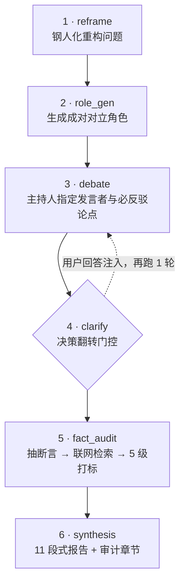

# 圆桌对抗思辨 · Roundtable Debate

[English](README_EN.md) ｜ [完整示例输出](examples/sample-report.md)


> 一个装在 AI 里的**决策陪练**。你给一个拿不准的问题，它强制对立地辩论、中途反问你、再逐句查证，最后给你一份带证据刻度的报告。
>
> 它的目标不是让你更快得到答案，是**让你更难骗自己**。

---

## 它解决什么问题

不是"多视角分析"这个需求本身，而是**多角色 LLM 讨论的四种系统性失败模式**：

| # | 失败模式 | 表现 | 本项目的反制 |
|---|---|---|---|
| 1 | 稻草人化 | 反方被写成弱鸡版本，正方轻松获胜，辩论是走过场 | 成对对立角色 + 钢人纪律 |
| 2 | 虚假收敛 | LLM 自评"我们达成共识了"，实际只是互相附和 + 讨好用户 | 共识分用代码算，不让模型自评 |
| 3 | 问题未定义 | 问题本身没想清楚就开辩，答的全是被误解的那个问题 | reframe 钢人化重构 + 决策翻转门控 |
| 4 | 事实与判断混同 | 观点、推测、事实混在一起输出，看起来都很有道理 | 双步事实审计 + 5 级可信度标签 |

---

## 60 秒看效果

**你只输入一句话：**

> 帮我想清楚：我在准备 AI 产品经理面试，同时有个传统制造业客户想让我做 AI 落地，报价 3 万。我该接吗？

**普通 AI 会回答：**

> 接有接的好处，不接也有不接的道理。建议你综合评估自身时间与现金流状况，权衡机会成本后再做决定。总体而言，若时间允许，可以考虑接下……

**这个 Skill 会：**

1. 先把你的问题重述成真正的决策，并挖出你没说出口的假设
2. 生成 5 个角色两两对冲地吵（含一个直接质疑"你真正的问题不是接不接"的反对者）
3. **停下来问你一个问题**，等你回答后再跑一轮
4. 把全场发言逐条联网核查，标注可信度
5. 输出一份 11 段式报告，每条结论可溯源到发言编号

**最终你拿到的关键三段：**

```markdown
## 真实分歧 (Core Disagreement)
不是"接不接"，而是「这 3 万买的是现金流，还是买一个可写进简历的案例」——
现金流派(#1,#5)认为买的是现金流；机会成本派(#2,#8)认为你真正缺的是案例，
而 3 万一单交付太浅，撑不起一个有说服力的案例。两派对"这单能否变成资产"判断相反。

## 可能改变结论的关键变量 (Decision-Flipping Variables)
1. 面试时间线是否已定（未定 → 接的代价被高估）
2. 客户是否愿意给署名案例 / 内推（愿意 → 结论从"不接"翻转为"接"）

## 落地建议 (Final Recommendation)
先接，但把合同改造成"资产型订单"：要求署名案例 + 交付后推荐信，
并把交付范围压缩到 2 周内的一个可演示模块。若客户不接受署名条款，则不接。
```

完整的一次运行输出见 [`examples/sample-report.md`](examples/sample-report.md)。

---

## 快速开始

### 方式 A：作为 Skill 使用（推荐）

把整个目录复制到你的 skills 目录即可，零依赖、零配置：

```bash
# WorkBuddy / 类 Claude Code 客户端
cp -r roundtable-debate ~/.workbuddy/skills/

# 或作为项目级 skill
cp -r roundtable-debate .workbuddy/skills/
```

然后直接说：

```
帮我想清楚：<你的问题>
用圆桌分析一下：<你的问题>
```

### 方式 B：不安装，直接用 prompt

不想装任何东西？打开任意支持长上下文的 LLM，按 [`references/prompts.md`](references/prompts.md) 的顺序，把六个阶段的 prompt 依次贴进去。全部是填参模板，不绑定任何框架。

### 方式 C：跑成独立应用

想做成带流式 UI 的多智能体服务？看 [`references/architecture.md`](references/architecture.md)——含 LangGraph 状态图、FastAPI/SSE、React 前端设计，以及 5 个已踩过的工程坑。

---

## 流程



| 阶段 | 做什么 | 关键产出 |
|---|---|---|
| `reframe` | 钢人化重构：真实决策 + 两个选项 + 隐含假设 + 关键不确定项 | `reframed_decision` / `options` / `hidden_assumptions` |
| `role_gen` | 围绕两个选项生成**成对对立**角色，强制含 1 个反对者 | 角色列表 + `sub_goals` |
| `debate` | 主持人指定发言者与反驳目标，每轮结尾输出一句 `POSITION` | `transcript` |
| `clarify` | ⛔ 暂停，向用户追问**唯一**最可能改变结论的问题 | `clarify_question` + 用户回答 |
| `fact_audit` | 抽取事实性/结论性断言 → 逐条联网检索 → 5 级标签 + 推理链体检 | `FactAuditResult` |
| `synthesis` | 带溯源的 11 段式报告 + 事实审计章节 | 结构化 Markdown |

---

## 六个核心机制

### ① reframe：先质疑你的问题，不是先回答你的问题

开场强制输出：真实决策 / 两个选项 / 隐含假设 / 关键不确定项。

> 大多数"分析"失败在第一公里——它回答的是一个你没问、也没想清楚的问题。

### ② 成对对立角色：thesis / antithesis

每个角色带 `stance` + `must_challenge`（必质疑对象），围绕两个真实选项成组生成。**反对者角色不可省略**，除非已有明确的风险/质疑立场角色。

### ③ 钢人纪律（写进每个角色的 persona）

无论立场是什么，发言时必须先呈现它的**最强版本**：

1. 成立所需的适用条件
2. 能带来的最大收益
3. 必须承认的最大风险
4. **自己最难回答的那个反对意见**（即使不同意，不许回避或弱化）

这条是防稻草人化的核心。

### ④ 共识分用代码算，不让 LLM 自评

```
consensus_score = 0.5 × Jaccard(关键词重叠) + 0.5 × 立场极性对齐
```

纯代码计算，0–100。LLM 说"我们达成一致了"不算数——它天生倾向于附和。

### ⑤ 决策翻转门控

收敛前强制暂停，只问**一个**问题：最可能改变结论的那个未知量。用户回答作为一条「用户补充」发言注入，再跑 1 轮聚焦辩论。

> 只问一个。问多了是问卷，不是门控。

### ⑥ 双步事实审计

1. **抽取**：从全场发言中抽取可核查断言，区分 `fact`（经验事实）/ `conclusion`（推出的结论）/ `judgment`（价值判断，只标注不深挖）
2. **核查**：逐条联网检索 → 打 5 级标签 → 推理链体检（藏而未言的假设、把相关当因果、遗漏的其他解释）

---

## 反过度信任设计

这套设计的目的不是让报告"看起来严谨"，而是**阻止你把没证据的话当成有证据**。

| 等级 | 标签 | 判定条件 |
|:---:|---|---|
| 1 🟢 | 已证实 | 检索到多个可靠来源相互印证 |
| 2 🟡 | 基本成立但需收窄 | 有来源支持，但适用边界比断言更窄 |
| 3 🟠 | 存在争议 | 有来源支持，也有来源反对 |
| 4 🔴 | 证据不足 | **未检索到证据时的默认值** |
| 5 ⛔ | 明显错误 | 有可靠来源直接反驳 |

两条硬纪律：

- **默认保守**：证据为空一律标 `4=证据不足`；只有检索到可靠来源才允许标 `1/2`
- **取最差不取平均**：每条发言的可信度 = 其所含断言的**最差等级**
- **措辞纪律**：用"证据不足"而非"未证实"——避免把"已联网核查"读成"已证实"

---

## 目录结构

```
roundtable-debate/
├── SKILL.md                    主文件：六阶段工作流 + 关键纪律
├── references/
│   ├── prompts.md              六阶段完整 prompt 模板（只输出 JSON）
│   └── architecture.md         做成独立应用的架构 + 5 个工程坑
├── examples/
│   └── sample-report.md        一次完整运行的真实输出
├── assets/
│   └── cover.jpg               一页纸长图（60 秒看懂）
├── LICENSE
└── README.md
```

---

## 适用边界

**适用**：重要决策前的对抗性思辨、方案/PRD 的风险挑刺、对 AI 生成内容做事实核查。

**不适用**：

- 纯事实问答（直接查就行，别开圆桌）
- 无决策目标的创意发散（没有"该不该"，就没有对立面）
- 需要实时多人协作的场景

**已知限制**：

- 默认检索后端是通用搜索。投研 / 法律 / 医疗等专业场景必须换成垂直数据源，否则 5 级标签只是**看起来严谨的空壳**。
- 无联网环境时，事实审计降级为内部评估，并显式标注"证据不足"。
- N 角色 × M 轮 + 逐条检索会很慢。做成应用时建议异步跑 + 报告推送。

---

## 从 Skill 到应用：5 个已踩过的坑

完整架构见 [`references/architecture.md`](references/architecture.md)，这里只列最痛的五条——对任何 LangGraph 多智能体项目都通用：

1. `interrupt` 在 `astream` 下以特殊键 `__interrupt__` 暴露，**不是节点名**，服务端流处理必须特判
2. SSE 是单向流，clarify 需要**有状态 run**：先返回 `run_id` + MemorySaver，再用 `POST /{run_id}/answer` + `Command(resume=)` 续跑
3. `extract_json` 必须**非贪心解析**（找首个 `{` 后做括号深度匹配），否则 LLM 在 JSON 后补的杂文会截断解析
4. 角色状态要静态/动态分离，共识分用 `Annotated[..., add]` reducer 隔离追加，防回声室
5. 专业场景必须换垂直检索源（Wind / 财汇 / 企查查 / 北大法宝 / 妙想）

---

## 常见问题

**Q：和"让 AI 扮演几个专家开会"有什么本质区别？**
A：普通多角色 prompt 解决的是"覆盖多个视角"；本项目解决的是"AI 会讨好你、会自评共识、会编事实"。六个机制全是为后者设计的。

**Q：为什么要停下来问我问题？直接跑完不行吗？**
A：不行。针对一个被误解的问题跑得越充分，错得越自信。门控是唯一一道"确认我们在讨论同一个问题"的保险。

**Q：报告里的"已证实"可信吗？**
A：它只代表"检索到了相互印证的可靠来源"。如果你想让它更可信，换垂直数据源（见"已知限制"）。

**Q：能不能只用其中几个阶段？**
A：可以，但有下限：`reframe`、`clarify`、`fact_audit` 不建议省。省掉它们，剩下的就是一场普通的角色扮演。

---

## 贡献

欢迎提 issue 和 PR。特别欢迎这几类：

- 垂直领域的检索后端适配（投研 / 法律 / 医疗）
- 新的报告段落模板（比如面向投资尽调、面向产品立项）
- 真实运行案例（补充到 `examples/`）

提交前请确保：prompt 改动附带一次真实运行的输出对比。

## License

MIT

## 致谢

方法论提炼自 `brainstorm_agent`（圆桌多角色头脑风暴 Agent）项目。钢人论证、红队/魔鬼代言人等思路来自既有的批判性思维传统，本项目做的是把它们变成一套**可强制执行的流程**。
