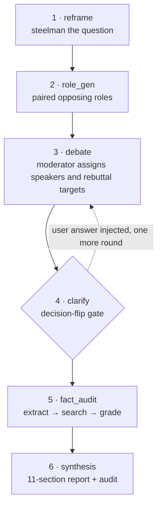

# Roundtable Debate

[中文](README.md) ｜ [Full example output](examples/sample-report.md)


> A **decision sparring partner** you install into your AI. Give it a question you can't settle, and it forces an adversarial debate, stops to interrogate you once, fact-checks every claim, and returns a report with evidence grades.
>
> Its goal isn't to give you an answer faster. It's to **make it harder for you to fool yourself.**

> Note: the prompt templates and report output are in Chinese by design. The structure is language-agnostic — swap the templates in `references/prompts.md` to run it in any language.

---

## What problem it solves

Not "multi-perspective analysis" — that's easy. This addresses **four systematic failure modes of multi-agent LLM discussion**:

| # | Failure mode | What it looks like | Countermeasure |
|---|---|---|---|
| 1 | Strawmanning | The opposition is written as a pushover; the debate is theater | Paired adversarial roles + steelman discipline |
| 2 | Fake convergence | The model declares "we've reached consensus" because it wants to please you | Consensus score computed in code, never self-reported |
| 3 | Undefined question | It debates a question you never actually asked | Reframe + decision-flip gate |
| 4 | Facts mixed with judgments | Speculation reads exactly like verified fact | Two-step fact audit + 5-level credibility labels |

---

## 60-second example

**You type one sentence:**

> Help me think this through: I'm job-hunting for AI PM roles, and a manufacturing client wants me to build an AI solution for ¥30k. Should I take it?

**A normal AI answers:**

> There are benefits either way. Consider your time and cash flow, weigh the opportunity cost, and decide. Overall, if your schedule allows it, you could take it...

**This skill:**

1. Restates your question as the real decision and surfaces the assumptions you didn't say out loud
2. Spawns 5 roles that argue in paired opposition, including one that attacks your framing itself
3. **Stops and asks you exactly one question**, then runs one more round
4. Fact-checks every claim made during the debate and grades it
5. Outputs an 11-section report where every conclusion traces back to a speaker and turn ID

See [`examples/sample-report.md`](examples/sample-report.md) for a full run.

---

## Quick start

**As a skill** (zero dependencies, zero config):

```bash
cp -r roundtable-debate ~/.workbuddy/skills/
```

Then just say: `帮我想清楚：<your question>`

**Without installing anything:** paste the six prompt templates from [`references/prompts.md`](references/prompts.md) into any long-context LLM, in order. They're fill-in templates, framework-agnostic.

**As a standalone app:** see [`references/architecture.md`](references/architecture.md) — LangGraph state graph, FastAPI/SSE, React frontend, plus 5 engineering pitfalls already hit.

---

## The pipeline



---

## Six mechanisms

1. **Reframe** — challenge the question before answering it. Forces out: the real decision, two options, hidden assumptions, key uncertainties.
2. **Paired opposing roles** — thesis/antithesis pairs, each with a `stance` and a `must_challenge` target. A dedicated dissenter is mandatory.
3. **Steelman discipline** — every speaker must present the strongest version of their own position first: conditions for it to hold, maximum upside, maximum risk, and *the objection they find hardest to answer*.
4. **Consensus computed, not declared** — `0.5 × Jaccard(keyword overlap) + 0.5 × stance polarity alignment`, in code. The model is never allowed to grade its own agreement.
5. **Decision-flip gate** — a hard pause before convergence to ask **one** question: the unknown most likely to change the conclusion. The answer is injected and one more round runs.
6. **Two-step fact audit** — extract checkable claims (split into `fact` / `conclusion` / `judgment`), then search each one and grade it, plus a reasoning-chain checkup.

---

## Anti-overtrust design

| Level | Label | Condition |
|:---:|---|---|
| 1 🟢 | Verified | Multiple reliable sources corroborate |
| 2 🟡 | Holds, needs narrowing | Supported, but scope is narrower than claimed |
| 3 🟠 | Contested | Sources support and sources contradict |
| 4 🔴 | Insufficient evidence | **Default when no evidence is found** |
| 5 ⛔ | Clearly wrong | Reliable sources directly contradict |

Two hard rules:

- **Conservative by default** — empty evidence always grades `4`; `1` and `2` require actual retrieved sources
- **Worst, not average** — a turn's credibility is the *worst* grade among its claims
- **Wording discipline** — "insufficient evidence", never "disproven"; so "was searched" doesn't get read as "was verified"

---

## Boundaries

**Good for:** adversarial thinking before a real decision, stress-testing a plan or PRD, fact-checking AI-generated content.

**Not for:** pure factual Q&A, open-ended ideation with no decision at stake, real-time multi-human collaboration.

**Known limits:**

- The default search backend is general web search. For finance, legal, or medical use, swap in a vertical data source — otherwise the 5-level labels are a **rigor-looking shell**.
- With no network, the audit degrades to internal assessment and explicitly labels everything "insufficient evidence".
- N roles × M rounds + per-claim search is slow. For an app, run async and push the report.

---

## Contributing

Issues and PRs welcome, especially: vertical search backends, new report templates (due diligence, product kickoff), and real run logs for `examples/`.

## License

MIT
